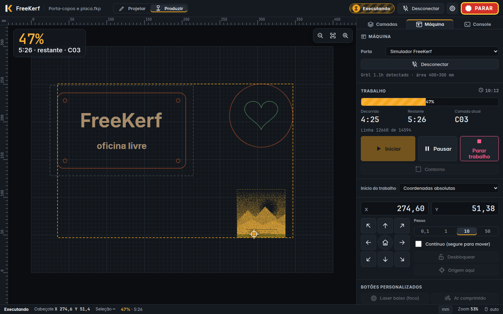

# FreeKerf: design, identidade e protótipo

O FreeKerf é software livre (GPL-3.0-or-later) de design e controle para máquinas laser (GRBL, grblHAL, Smoothie, Marlin…). É a **evolução do LaserGRBL**, criado por Diego Settimi, e será reescrito em Rust, multiplataforma, com uso fluido por mouse/teclado **e** toque.

Esta pasta contém **apenas design, identidade e protótipo**. Não há código Rust aqui.



## Índice

| Documento | Conteúdo |
|---|---|
| [`brand/brand.md`](brand/brand.md) | conceito, logo escolhido, construção, paleta, nome, voz e tom, segurança sem alarmismo |
| [`brand/concepts/concepts.html`](brand/concepts/concepts.html) | os 5 conceitos de logo lado a lado ([PNG](brand/concepts/concepts.png)) |
| [`brand/tests/brand-test.html`](brand/tests/brand-test.html) | logo e ícone em claro/escuro, barras de tarefas, 16 px ([PNG](brand/tests/brand-test.png)) |
| [`research.md`](research.md) | LightBurn, LaserCut, Rayforge, MeerK40t, OpenKerf, funcionalidades do LaserGRBL, matriz MVP/v1/depois |
| [`ux.md`](ux.md) | personas, estrutura, modos Projetar/Produzir, estados da máquina, segurança, 8 fluxos |
| [`interaction.md`](interaction.md) | mouse/teclado/caneta/toque, gestos, jog, atalhos, layouts responsivos, uso em oficina |
| [`design-system.md`](design-system.md) | tokens `fk-`, cores (com contrastes medidos), tipografia, densidade, inventário de componentes |
| [`tokens.json`](tokens.json) | tokens W3C Design Tokens → [`tokens/fk-tokens.css`](tokens/fk-tokens.css) via `tokens/build_tokens.py` |
| [`tech-notes.md`](tech-notes.md) | egui × Slint × iced × Tauri × Flutter, recomendação e spike |
| [`prototypes/wireframes/`](prototypes/wireframes/index.html) | wireframes de baixa fidelidade (desktop, notebook/touch, tablet paisagem, retrato/celular) |
| [`prototypes/app/`](prototypes/app/index.html) | **protótipo navegável de alta fidelidade** |
| [`prototypes/screenshots/`](prototypes/screenshots/) | 23 screenshots (4 tamanhos × 2 temas + estados) |
| [`CREDITS.md`](CREDITS.md) | licenças de fontes, ícones e ferramentas |

## Como abrir o protótipo

Abra **`prototypes/app/index.html`** direto no navegador (Chrome, Edge, Safari). Não há build nem dependências.

> O Firefox pode bloquear as fontes da pasta `assets/` quando o arquivo é aberto pelo disco. Nesse caso, ele usa a fonte do sistema (o layout continua funcionando). Para ver exatamente como nas screenshots, sirva a pasta:
> ```bash
> python3 -m http.server 8765
> ```
> e abra `http://localhost:8765/prototypes/app/`.

**O que experimentar**
- **Canvas:** arraste objetos; use as alças para redimensionar e girar (Shift = 15°); roda do mouse = zoom; Espaço/botão do meio = pan; arrastar no vazio = seleção por área (→ janela, ← cruzamento). No toque: pinça, um dedo no vazio = pan, toque longo = menu, toque longo + arrastar = seleção por área.
- **Camadas:** toque numa cor da paleta com objetos selecionados para mudar a camada. Expanda uma camada para editar modo, velocidade, potência, passadas e ar, ou aplicar um material.
- **Desenhar:** R (retângulo), E (elipse), T (texto). A imagem de exemplo tem brilho, contraste e pontilhado no inspetor.
- **Máquina:** Conectar (simulador) → Contorno → Iniciar → confirmação com contagem → o cabeçote percorre o desenho e deixa o rastro de queima. Pausar, Parar trabalho, **PARAR**. Em "Simular falha": alarme de limite ou queda de conexão → **Recuperar trabalho…**
- **⚙:** tema claro/escuro, alto contraste, densidade (automática/compacta/toque), **idioma Deutsch** (teste de strings longas), mm/pol, atalhos, rever boas-vindas.
- **Responsivo:** redimensione a janela: largo ≥ 1180 px, médio (gavetas) 820–1179 px, estreito < 820 px (só máquina).

Parâmetros de URL (usados nas screenshots): `welcome=0|1`, `wstep=kind|conn|migrate|ready`, `theme=light`, `contrast=1`, `density=compact|comfortable`, `lang=de`, `mode=produce`, `sel=text|image|multi`, `panel=layers|object|machine|console`, `demo=run|hold|alarm|recover|preflight`.

Screenshots: com o servidor acima rodando, `sh prototypes/screenshots/make-screenshots.sh`.

## Decisões principais

1. **Logo "K-corte".** Um K feito de duas peças separadas por um kerf, com o feixe passando pela fenda. Foi o único dos 5 conceitos que lê como letra em 16 px, conta a história do nome (o vão do corte) e não se parece com nenhuma marca do setor. Âmbar sobre grafite.
2. **Âmbar como cor da marca, nada de vermelho/verde puros.** O âmbar atravessa óculos de proteção laranja de diodo. Vermelho fica só para o PARAR. Todo estado tem ícone + palavra (+ padrão).
3. **Um espaço de trabalho com dois modos (Projetar / Produzir)** em vez de dezenas de janelas acopláveis. Iniciar um trabalho leva a Produzir sozinho.
4. **Estado e PARAR sempre visíveis e clicáveis**, inclusive com diálogos abertos (diálogos não modais, barra superior por cima do fundo). Shift+Esc em qualquer lugar.
5. **Confirmação antes de disparar** com checklist de bancada e 3 s de espera (herança da contagem do LaserGRBL). **Recuperação de trabalho** com a lógica do `ResumeJobForm`.
6. **Densidade automática pelo tipo de entrada** (Pointer Events), independente do layout por largura.
7. **Sem edição abaixo de 820 px:** tablet em retrato e celular servem para operar e vigiar. Ações na barra inferior, na zona do polegar.
8. **Toolkit: Tauri 2 + `freekerf-core` em Rust**, com Flutter como plano B, condicionado a um spike que valide o WebKitGTK no Linux e o desempenho do canvas.
9. **Migração do LaserGRBL é funcionalidade de MVP** (conexão, botões `.zbn`, materiais, contadores de uso, atalhos).

## Perguntas em aberto

1. **Produzir em janela própria?** Permitir abrir o modo Produzir numa segunda janela/monitor (ex.: monitor touch na máquina e desktop no escritório, ligados ao mesmo `freekerf-core`)?
2. **Celular só monitora?** Assumi que tablet retrato e celular não editam. Quer edição básica (mover/escalar o trabalho inteiro) no tablet em retrato?
3. **Tablet como cliente remoto (fluxo 8):** entra em qual versão? Isso define cedo a API de eventos do `freekerf-core`.
4. **Nome e marca:** fazer busca de marca registrada para "FreeKerf"; registrar domínio e organização (proposta de ID: `io.github.freekerf.FreeKerf`). Como nos posicionar em relação ao **OpenKerf** (nome parecido)?
5. **Licença dos assets da marca:** logo sob GPL como o código, ou CC BY-SA + política de uso de marca para forks (estilo Firefox/Blender)?
6. **Contagem de segurança:** 3 s (proposto) ou 5 s como no LaserGRBL? Permitir desligar (o LaserGRBL permite)?
7. **Atalhos padrão:** esquema próprio (proposto) com o do LaserGRBL opcional, ou adotar o do LaserGRBL como padrão para não quebrar o hábito dos usuários atuais?
8. **Firmwares no MVP:** só GRBL/grblHAL, deixando Smoothie, Marlin e VigoWork para a v1?
9. **Formato de projeto `.fkp`:** proponho ZIP aberto (JSON + assets) e importação de `.lps` do LaserGRBL. De acordo?
10. **PARAR:** soft reset (0x18) direto, como no protótipo, ou feed hold + reset? Mostrar no primeiro uso um aviso único de que ele não substitui a parada de emergência física?
11. **Spike de toolkit:** aprova as 2–3 semanas de spike Tauri × Flutter descritas em `tech-notes.md` antes de começar a UI?

## Créditos

FreeKerf é uma evolução do **LaserGRBL** © Diego Settimi (GPLv3). Os fluxos se inspiram em padrões de mercado (LightBurn, LaserCut), sem usar nenhum asset, ícone ou identidade visual deles. Veja [`CREDITS.md`](CREDITS.md).

## Licença

[GPL-3.0-or-later](LICENSE). Derivado do LaserGRBL, Copyright (c) 2016 Diego Settimi ([NOTICE](NOTICE)). Fontes de terceiros sob SIL OFL-1.1 (ver [CREDITS.md](CREDITS.md)). O código do Rust fica em [`freekerf/freekerf`](https://github.com/freekerf/freekerf).
