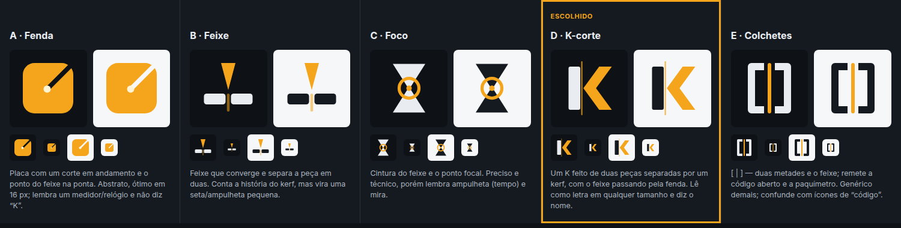

# FreeKerf: marca

## Conceito

**Kerf** é a largura do material que o feixe remove no corte: o vão estreito entre a peça e a sobra. **Free** é de software livre (GPL-3.0-or-later) e de comunidade. Juntos, os dois nomes dizem duas coisas: precisão de décimo de milímetro e ferramenta aberta, sem licença paga nem dongle.

O FreeKerf é a **evolução do LaserGRBL**, criado por **Diego Settimi**. Citamos a origem com orgulho e crédito, mas o FreeKerf não é o "LaserGRBL oficial" e não usa a marca LaserGRBL como se fosse sua.

Três valores guiam todas as decisões visuais e de texto:

| Valor | Como aparece |
|---|---|
| **Precisão** | geometria de grade, números em fonte mono tabular, réguas, nada "fofo" |
| **Liberdade / comunidade** | tom direto e acolhedor; formatos abertos; importação do LaserGRBL; nada escondido atrás de "Pro" |
| **Segurança** | estado da máquina sempre visível, PARAR sempre alcançável, mensagens calmas e acionáveis |

## Símbolo escolhido: "K-corte"

Um **K formado por duas peças**: a haste (stem) e a ponta de seta (os braços). Elas são separadas por um vão estreito, **o kerf**. Uma linha fina âmbar, **o feixe**, atravessa o vão de cima a baixo: a letra está sendo cortada.

- Lê como **letra K** de 512 px a 16 px, o que ajuda a lembrar o nome.
- Conta a história do produto (feixe + vão) sem cair no clichê do raio laser.
- Funciona em duas cores e em uma cor só, então dá para gravar a laser, fazer carimbo ou estampar em camiseta.
- Não se parece com as marcas de LightBurn, LaserCut, Rayforge, MeerK40t ou OpenKerf, que não usam K nem ponta de seta.

Os outros conceitos (A Fenda, B Feixe, C Foco, E Colchetes) e o motivo de cada um ter sido descartado estão em [`concepts/concepts.html`](concepts/concepts.html).

### Construção (grade 64)

- Haste: `x 9–22, y 8–56`, cantos com raio 2.
- Braços: polígono `43,8 · 57,8 · 39.5,32 · 57,56 · 43,56 · 25.5,32`. Os dois braços são paralelos e a inclinação é a mesma das diagonais do K.
- Kerf: vão de 3,5 unidades entre a haste e o vértice dos braços (≈ 5,5 % da altura).
- Feixe: 1,5 unidade de largura, `x 23–24.5`, de `y 2` a `y 62`, opacidade 75 %.
- Em **≤ 32 px** o feixe some e o vão é redesenhado na grade de pixels (`icon/freekerf-32.svg`, `icon/freekerf-16.svg`).

### Área de proteção e tamanho mínimo

- Margem livre em volta = **largura da haste** (13/64 da altura do símbolo).
- Tamanho mínimo: símbolo **16 px** (versão de 16 px); horizontal **20 px** de altura.

## Arquivos

| Uso | Arquivo |
|---|---|
| Horizontal, fundo escuro | `logo/freekerf-horizontal-dark.svg` |
| Horizontal, fundo claro | `logo/freekerf-horizontal-light.svg` |
| Horizontal, monocromático | `logo/freekerf-horizontal-mono-black.svg`, `…-mono-white.svg` |
| Símbolo (mesmas 4 variações) | `logo/freekerf-symbol-*.svg` |
| Ícone do app (Linux/Windows), vetorial | `icon/freekerf.svg` (64), `icon/freekerf-32.svg`, `icon/freekerf-16.svg` |
| Ícone macOS | `icon/freekerf-macos.svg` (grade 1024, forma de 824 px com margem e sombra) |
| PNG | `icon/png/freekerf-{16,24,32,48,64,128,256,512,1024}.png`, `icon/png/freekerf-macos-*.png` |
| Windows | `icon/freekerf.ico` (16, 24, 32, 48, 256) |
| macOS | `icon/freekerf.icns` |
| freedesktop | `icon/hicolor/<tam>/apps/freekerf.png`, `scalable/apps/freekerf.svg`, `symbolic/apps/freekerf-symbolic.svg` |
| Favicon | `icon/favicon.svg`, `icon/favicon.ico` |
| Testes visuais | `tests/brand-test.html` → `tests/brand-test.png` |

Tudo é gerado por `tools/build_brand.py` (contornos do wordmark via fontTools) e `tools/render_icons.py` (Chrome headless + Pillow). **Não edite os SVGs à mão.** Mude o script e gere de novo.

### Convenções por plataforma

- **Linux (freedesktop / GNOME / KDE):** ID do app em DNS reverso (proposta: `io.github.freekerf.FreeKerf`, veja perguntas abertas no README), ícone `scalable` em SVG mais PNGs no tema `hicolor`, ícone `-symbolic` monocromático de 16 px para o painel. O ladrilho escuro arredondado segue o "ícone com forma própria" aceito pelo GNOME HIG.
- **Windows:** `.ico` com vários tamanhos. Em 16 e 32 px usamos os desenhos de grade própria, e não o SVG reduzido. O ladrilho tem borda de 1 px (`#3A434F`) para não sumir na barra de tarefas escura.
- **macOS:** forma arredondada de 824/1024 com margem, gradiente sutil e sombra, como pedem os modelos de ícone a partir do Big Sur, mais `.icns`.

## Wordmark

`Free` em **Space Grotesk Medium** + `Kerf` em **Space Grotesk Bold**, convertidos em contornos (o logo não depende da fonte instalada). O K maiúsculo continua a letra do símbolo.

**Como escrever o nome:**

- Sempre **FreeKerf**: uma palavra, F e K maiúsculos.
- Nunca ~~Freekerf~~, ~~Free Kerf~~, ~~FREEKERF~~ (exceto em siglas técnicas), ~~Free-Kerf~~, ~~FK~~ em texto corrido.
- O nome **não é traduzido** em nenhum idioma.
- Comandos, pacotes e binários vão em minúsculas: `freekerf` (app), `freekerf-core` (núcleo/serviço sem interface), `freekerf-cli` (se existir). Projeto: `.fkp`. Biblioteca de materiais: `.fkmat`.

## Paleta da marca

| Nome | Hex | Uso |
|---|---|---|
| **Âmbar Kerf** | `#F4A51C` | cor da marca, ação primária, feixe |
| Âmbar profundo | `#B86E00` | âmbar sobre fundo claro (gráfico) |
| Âmbar texto (claro) | `#8A5200` | texto/links âmbar sobre branco (contraste ≥ 4,5:1) |
| Grafite 950 | `#0E1115` | fundo escuro |
| Grafite 900 | `#151A20` | haste no claro, painéis |
| Papel | `#E9EDF2` | haste no escuro, texto |

**Por que âmbar e não vermelho ou verde:** os óculos de laser de diodo (445–455 nm) costumam ser laranja/vermelhos e escurecem azuis, cianos e verdes. O âmbar continua legível através deles. Já os óculos de CO₂ são quase transparentes e não alteram as cores. Vermelho puro fica reservado ao **PARAR** (convenção de máquina), e mesmo ali ele vem com forma octogonal, anel amarelo e texto. Detalhes em [`../design-system.md`](../design-system.md).

## Personalidade e voz

O FreeKerf fala como um **colega experiente de oficina**: direto, calmo, preciso, sem jargão de marketing e sem bronca.

| Somos | Não somos |
|---|---|
| Diretos: "Conecte a máquina primeiro." | Vagos: "Ocorreu um problema." |
| Precisos: "Alarme 1: chave de limite acionada na linha 7079." | Técnicos à toa: "ALARM:1 0x01 HW_LIMIT" (o código vai no console, não no título) |
| Calmos: "O controlador desligou o laser." | Alarmistas: "PERIGO!!! FALHA CRÍTICA!" |
| Acionáveis: sempre o próximo passo ("Desbloquear", "Recuperar trabalho…") | Becos sem saída: "Erro. OK." |
| Acolhedores com iniciantes, sem tratar ninguém como criança | Condescendentes: "Ops! Parece que você fez algo errado 🙈" |

### Regras de texto da interface

1. **Verbos no infinitivo** em botões: *Iniciar*, *Pausar*, *Conectar*, *Recuperar trabalho…* (as reticências indicam que um diálogo vai abrir).
2. **Sujeito claro** em mensagens de estado: "*A máquina* parou de responder", "*O controlador* desligou o laser".
3. **Números com unidade** sempre: "3000 mm/min", "45 %", "1,5 mm". Use o separador decimal da língua (vírgula em pt-BR).
4. **Sem culpa**: o software informa o que aconteceu e o que fazer. Não acusa o usuário.
5. **Frases curtas.** Títulos de diálogo com até 5 palavras. Corpo com até 2 frases.
6. **Sem concatenar strings.** Toda frase é uma chave i18n com placeholders (`{n}`, `{t}`). O alemão é ~35 % mais longo e o layout precisa aguentar (veja `prototypes/app/i18n.js`).

### Mensagens de erro: modelo

> **[O que aconteceu, em linguagem humana]**
> [Onde/quando, com dado concreto.] [O que o sistema já fez para ficar seguro.]
> [Ação principal] [Ação secundária]

Exemplo: **Conexão perdida.** A máquina parou de responder na linha 7110. O controlador desligou o laser. `[Recuperar trabalho…]` `[Agora não]`

### Como falar de segurança sem alarmismo

- **Lembrar, não assustar.** A confirmação antes de disparar é uma *checklist de bancada* ("Óculos certos para este laser", "Exaustão ligada"), não um aviso jurídico.
- **Dizer o que o software já fez** ("laser desligado") antes de pedir algo ao usuário. Isso reduz o pânico.
- **Ser honesto sobre limites:** o botão PARAR envia reset por software e **não substitui a parada de emergência física**. Isso aparece no tooltip e na documentação, uma vez, sem repetir em toda tela.
- **Nunca usar cor sozinha** para o perigo: ícone + palavra + forma.
- **Não pedir desculpas pelo laser.** Fogo, fumaça e reflexo são riscos reais e merecem frases curtas e concretas, sem pontos de exclamação.
